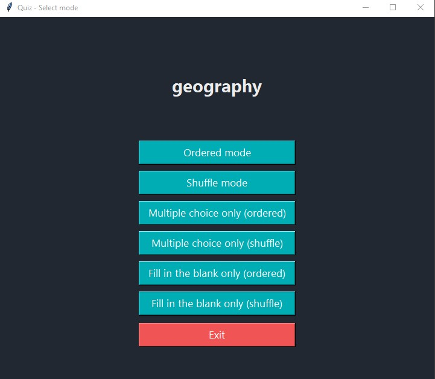

# 📝 Quiz GUI – Multi-subject Quiz Application in Python

Welcome to **Quiz GUI**, a simple and intuitive Python application that lets you practice with multiple-choice and fill-in-the-blank quizzes. The project is designed for students, teachers, or anyone who wants to create and take custom quizzes using a flexible `.json` question file.

---

## ✨ Main Features

- **Simple graphical interface** (Tkinter)
- Supports both **multiple choice** and **fill-in-the-blank** questions
- Modes: normal, shuffle, only multiple choice, only fill-in-the-blank
- Choose **custom question ranges** (e.g., questions 20-40)
- Retry wrong answers or retake the whole quiz in a new order
- Timer for total quiz time
- Fully compatible with any **custom JSON question database**

---

## 🚀 How to Install and Run

1. **Install Python 3.10 or newer**  
   Download Python from [python.org](https://www.python.org/downloads/).  
   > During installation, check “Add Python to PATH”.

2. **Download or clone this repository**
   ```bash
   git clone https://github.com/AlessandroDarie/quiz-gui.git
   cd quiz-gui
   ```
   Or download as a .zip and unzip it.

3. **Run the program**
   - **Easiest:**  
     Double-click on `quiz_gui.py`  
   - **From terminal:**  
     ```bash
     python quiz_gui.py
     ```

---

## 🗂️ File Structure

- `quiz_gui.py`  – Main program (Tkinter)
- `quiz_gui.pyw` – No-console version for Windows (optional)
- `geography.json` – Example question database (editable)
- `LICENSE` – MIT License
- `README.md` – This file
- `screenshots/` – (optional) App screenshots

---

## 📚 How it works

1. **Select a quiz mode** (ordered, shuffle, only multiple choice, only fill-in)
2. **Choose how many (or which) questions** you want to do (you can set a range, e.g., 20-40)
3. **Answer the questions** presented by the app
4. At the end, you can:
    - Retry only the incorrect answers
    - Retake all questions in a new random order
    - Return to the main menu and change mode

---

## 🧩 Use Your Own Database

You can create your own `.json` question file and point the program to it (by changing the `JSON_FILENAME` variable or replacing the sample file).

### **Supported structure:**
```json
[
  {
    "id": 1,
    "type": "crocette",
    "question": "Example multiple-choice question?",
    "options": {
      "A": "Option 1",
      "B": "Option 2",
      "C": "Option 3",
      "D": "Option 4",
      "E": "Option 5"
    },
    "answer": "B"
  },
  {
    "id": 2,
    "type": "dariempire",
    "question": "The capital of Italy is ________.",
    "answer": "Rome"
  }
]
```
- **type:** `"crocette"` (multiple choice) or `"dariempire"` (fill-in)
- **options:** Only for multiple choice, always 5 options (A-E)
- **answer:**  
    - A single letter (`"B"`) or a comma-separated string for multiple correct answers (`"B,D"`)
    - For fill-in questions, the correct word or phrase (`"Rome"`)

---

## 🌍 Example file

The included `geography.json` file contains several geography questions (multiple choice and fill-in).  
You can use it as a template to create more question sets (e.g., history, science, etc.).

---

## 🖼️ Screenshots

<p align="center">
  <br>
  <em>Main menu of the quiz</em>
</p>
<p align="center">
  <br>
  <em>Main menu of the quiz</em>
</p>
<p align="center">
  <br>
  <em>Main menu of the quiz</em>
</p>
<p align="center">
  <br>
  <em>Main menu of the quiz</em>
</p>

---

## 📝 License

This project is released under the MIT license.  

---

## 👨‍💻 Author

Developed by Alessandro Darie  
For suggestions, improvements, or issues, open an issue on GitHub!

---
